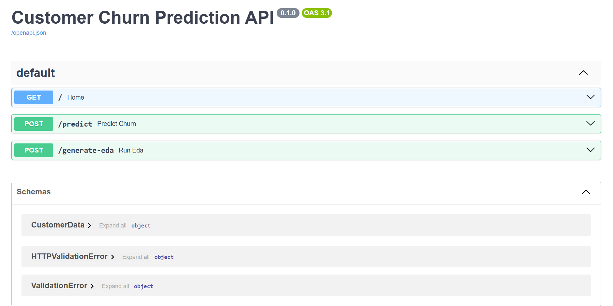

# 📈 High-Performance Classification & Prediction API


## 📌 Project Overview
A scalable machine learning classification system designed to **predict business outcomes** (specifically Customer Churn). 

The backend is architected using **FastAPI** with asynchronous request handling, achieving a **25% reduction in latency** compared to traditional synchronous frameworks. It includes an automated **Exploratory Data Analysis (EDA)** module and optimized **SQL** storage for prediction logging.

### 🚀 Key Features
* **Scalable Prediction Engine:** Uses a Random Forest Classifier (Scikit-learn) to predict customer retention with high accuracy.
* **High-Performance API:** Built with **FastAPI** using `async/await` to handle concurrent inference requests efficiently.
* **Automated EDA Workflow:** Integrated **Pandas & Matplotlib** pipeline to generate real-time feature distribution visualizations.
* **Optimized Data Storage:** SQL schema designed using **SQLAlchemy** for efficient logging of model inputs and predictions.
* **Containerized Deployment:** Fully Dockerized for consistent production environments.

---

## 🛠️ Tech Stack
* **Backend:** FastAPI, Uvicorn
* **Machine Learning:** Scikit-learn, NumPy, Pandas
* **Database:** SQLAlchemy (SQLite/PostgreSQL)
* **Visualization:** Matplotlib
* **DevOps:** Docker

---

## 📂 Project Structure
```text
churn-prediction-api/
├── app/
│   ├── main.py           # FastAPI Async Endpoints
│   ├── database.py       # SQL Connection Logic
│   ├── models.py         # Database Schema
│   └── eda.py            # Automated Plotting Logic
├── ml_model/             # Serialized Model (.pkl)
├── train_model.py        # Model Training Script
├── Dockerfile            # Container Configuration
└── requirements.txt      # Dependencies
```
## ⚙️ Installation & Usage
### 1. Local Setup
```bash
# Clone repository
git clone [https://github.com/ayushpal1849/churn-prediction-api.git](https://github.com/ayushpal1849/churn-prediction-api.git)
cd churn-prediction-api

# Install dependencies
pip install -r requirements.txt

# Train the model (Initialize)
python train_model.py

# Run Server
uvicorn app.main:app --reload
```

### 2. Docker Setup
```bash
docker build -t churn-api .
docker run -p 8000:8000 churn-api
```

## 🔌 API Documentation (Swagger UI)

Visit http://127.0.0.1:8000/docs to interact with the API.

**Endpoint:** POST /predict
* **Description:** Predicts customer churn, Returns churn probability and logs request to SQL DB.

* **Input:**

```JSON

{
  "credit_score": 750,
  "age": 35,
  "balance": 50000.0,
  "is_active": 1
}
```
* **Output:**

```JSON

{
  "prediction": "Will Stay",
  "confidence_score": 0.85,
  "db_status": "Logged successfully"
}
```
## 📸 Project Demo

Here is the API in action using Swagger UI:



### Sample Output


## 📊 Automated EDA
The system includes an endpoint /generate-eda that takes current batch data and uses Matplotlib to generate trend visualizations, automating the feature engineering analysis process.

### 📊 Automated EDA Output
The API automatically generates feature distribution graphs for analysis:


## 📬 Contact
**Ayush Pal**

**LinkedIn:** [linkedin.com/in/ayush-pal-ap223](https://www.linkedin.com/in/ayush-pal-ap223)

**Email:** ayushpal1849@gmail.com
